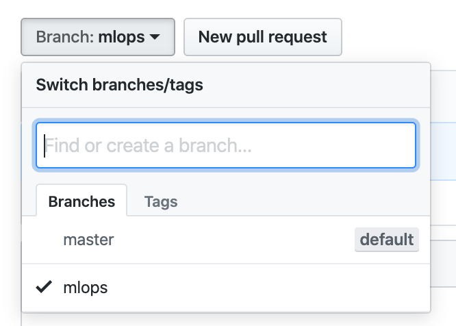

# KUBIG_2019_Winter
Repository for winter study

## How to

  

Create a branch for your study from master branch

## Contents 

1. [ML Ops](https://github.com/KU-BIG/KUBIG_2019_Winter/tree/mlops)
2. [Python](https://github.com/KU-BIG/KUBIG_2019_Winter/tree/python)
